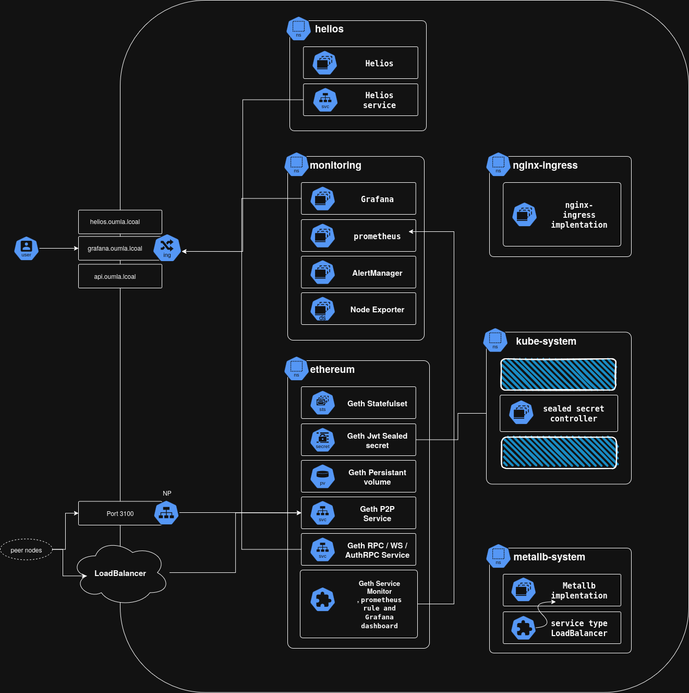
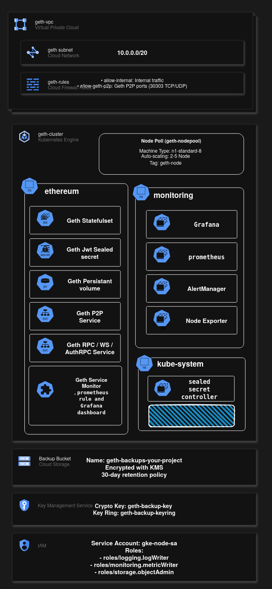

# Ethereum Execution Client Infrastructure – DevOps Assessment

## Executive Summary

This repository delivers a modular, reproducible, and cloud-adaptable solution for deploying an Ethereum execution client node using modern DevOps practices. The project is designed to highlight operational maturity, automation discipline, and production-aligned architectural thinking in managing stateful blockchain infrastructure within containerized environments.

Developed as part of a Senior DevOps Engineer technical assessment, this solution focuses on:

* Declarative infrastructure and deployment
* GitOps-oriented release management
* Kubernetes-native observability
* Network resiliency and security considerations
* Extensibility to hybrid and multi-cloud environments

[](https://github.com/alishahrudi/Eth-Execution-cient-assignment/actions/workflows/helm-lint.yaml)
[](https://github.com/alishahrudi/Eth-Execution-cient-assignment/actions/workflows/test-kind.yaml)
[](https://github.com/alishahrudi/Eth-Execution-cient-assignment/actions/workflows/terraform-validation.yaml)
## Table of Contents

- [Ethereum Execution Client Infrastructure – DevOps Assessment](#ethereum-execution-client-infrastructure--devops-assessment)
  - [Executive Summary](#executive-summary)
  - [Why We Should Operate Our Own Ethereum Node](#why-we-should-operate-our-own-ethereum-node)
    - [Where Public RPC Services Fall Short](#where-public-rpc-services-fall-short)
    - [Why This Is Still a Hard Decision](#why-this-is-still-a-hard-decision)
    - [Why It Makes Strategic Sense for Us](#why-it-makes-strategic-sense-for-us)
    - [Assumptions Before We Proceed](#assumptions-before-we-proceed)
  - [Technology Choices and Rationale](#technology-choices-and-rationale)
    - [Execution Client: Geth](#execution-client-geth)
    - [Synchronization Strategy: Snap Sync](#synchronization-strategy-snap-sync)
    - [Network: Sepolia Testnet](#network-sepolia-testnet)
  - [Infrastructure Architecture](#infrastructure-architecture)
    - [Deployment Framework](#deployment-framework)
    - [Network Exposure](#network-exposure)
    - [Secret Management: Sealed Secrets](#secret-management-sealed-secrets-gitops-safe-encryption-of-kubernetes-secrets)
    - [Observability Stack](#observability-stack)
  - [Production Considerations](#production-considerations)
    - [Infrastructure Provisioning](#infrastructure-provisioning)
    - [State Management and Disaster Recovery](#state-management-and-disaster-recovery)
    - [Light Client Integration (Helios)](#light-client-integration-helios)
    - [Design Automation and Lifecycle Management](#design-automation-and-lifecycle-management)
    - [Assumptions and Constraints](#assumptions-and-constraints)
    - [Repository Structure](#repository-structure)
  - [Setup Instructions (Local)](#setup-instructions-local)
  - [Setup Instructions (Production)](#setup-instructions-production)
  - [Monitoring / Alerting Documentation](#monitoring--alerting-documentation)
  - [Scalability and Reliability](#scalability-and-reliability)
  - [Usage Instructions](#usage-instructions)
  - [Constraints and Assumptions](#constraints-and-assumptions)
  - [Security Considerations](#security-considerations)


## Why We Should Operate Our Own Ethereum Node

Before we commit to deploying and maintaining our own Ethereum infrastructure, I want to be clear about **why this matters** and **what it means for us as an organization**.

First, let’s acknowledge the reality:
Operating a production-grade Ethereum node is not a “spin up and forget” exercise. It’s resource-intensive, requires specialized expertise, and will demand ongoing operational investment. Public RPC providers like Infura, Ankr, or publicnode can give us quick access to the network without these burdens — but at the cost of **control, reliability, and long-term flexibility**.


### Where Public RPC Services Fall Short

* **Rate Limits & Throughput Bottlenecks** – Under heavy load, public nodes will throttle requests. For mission-critical applications, this introduces unpredictable latency and failure points.
* **Vendor Dependency** – If they go down, we go down. We inherit their maintenance windows, upgrade cycles, and operational priorities — none of which we control.
* **Lack of Trust Boundaries** – We’re relying on someone else’s node for consensus data. We cannot independently verify the chain state or guarantee the provenance of the information returned.
* **No Customization** – Public RPCs are one-size-fits-all. If we need archive mode, debug APIs, or specialized telemetry, we won’t get it without running our own infrastructure.


### Why This Is Still a Hard Decision

Running our own node means:

* **Significant hardware requirements** (CPU, memory, SSD storage, and bandwidth)
* **Continuous operations** — monitoring, patching, upgrading, incident response
* **Backup and recovery** strategies to protect chain data
* **Scaling and failover** considerations for high availability

It’s not cheap — both in terms of infrastructure and people. Many companies decide against it because the cost outweighs the control.


### Why It Makes Strategic Sense for Us

If we decide to move forward, it’s because:

* We want **full operational control** over uptime, maintenance windows, and scaling.
* We have **compliance requirements** that demand chain data be validated and stored internally.
* We need **advanced telemetry and analytics** that public nodes can’t provide.
* At our projected transaction volume, **long-term cost optimization** favors in-house infrastructure over per-call public RPC billing.


### Assumptions Before We Proceed

I’m assuming that as a company, we have:

1. **Evaluated the trade-offs** between public and private nodes in terms of cost, complexity, and risk.
2. **Confirmed the strategic need** for operating our own node rather than relying on public infrastructure.
3. **Allocated the necessary budget and operational resources** to support this decision long-term.
4. **Agreed on compliance and security drivers** that make self-hosting the right move.

If those boxes are ticked, then we can confidently move forward knowing **we’re investing in control, reliability, and future-proofing — not just infrastructure for the sake of it**.


## Technology Choices and Rationale

### Execution Client: Geth

The [Go-Ethereum (Geth)](https://geth.ethereum.org/) client was selected as the execution engine for the following reasons:

* **Performance and Reliability**: Geth remains one of the most mature, performant Ethereum clients with widespread production use.
* **Operational Support**: Strong documentation and community tooling reduce the operational burden.
* **Developer Experience**: Geth’s interfaces and metrics are well-understood across ecosystems, accelerating integration with monitoring and orchestration tools.

> **Client Diversity Note**: In production environments, over-reliance on a single execution client introduces systemic risk. While Geth currently supports a majority share of the Ethereum network, it's advisable to include minority clients (e.g., Nethermind, Besu, Erigon) to reduce the likelihood of correlated failure modes.

### Synchronization Strategy: Snap Sync

In alignment with Ethereum’s client roadmap, Geth’s deprecated light sync mode is avoided in favor of **snap sync**, which offers:

* Rapid state bootstrapping via state trie snapshots
* Reduced disk I/O and sync times compared to full archival sync
* Production compatibility with both mainnet and testnet peers

Snap sync provides the optimal balance between completeness and operational efficiency for the node operator.

### Network: Sepolia Testnet

The **Sepolia test network** was chosen based on its alignment with real-world Ethereum infrastructure characteristics while maintaining low operational overhead. Advantages include:

* Full EVM equivalence and production parity
* Stable validator set managed by Ethereum Foundation
* Low cost of experimentation due to constrained gas markets and validator participation
* Fast finality and minimal chain reorganizations

This makes Sepolia ideal for simulating mainnet conditions in a cost-efficient and safe manner.


## Infrastructure Architecture

The solution is designed with environment-agnostic principles, suitable for deployment across:

* Local container platforms (KinD, Docker Desktop)
* Managed Kubernetes services (GKE, EKS, AKS)
* Hybrid or multi-cloud deployments via IaC modules

### Deployment Framework

* **Helm**: The primary templating engine used to deploy Geth and related components to Kubernetes. Helm provides parameterization, version control, and supports GitOps-aligned releases.
* **Makefile**: Used to standardize workflows across environments, abstract complexity, and ensure reproducibility in developer and CI/CD environments.

While Helm serves as the foundational tool for local orchestration, it is recommended that **Argo CD** be used in production environments to enable GitOps workflows, policy enforcement, and environment promotion pipelines.

### Network Exposure

* **MetalLB** is utilized to simulate L4 load balancer services within KinD environments, overcoming the lack of native load balancing support in local clusters.
* **Ingress-NGINX** provides L7 routing to expose the Ethereum JSON-RPC interfaces securely and predictably.
* These components mirror production ingress models while supporting rapid testing in local or CI contexts.
Great catch. Here’s an **addendum to your Infrastructure Architecture section** that introduces **Sealed Secrets** in an enterprise-grade way and ties it directly to your Makefile flow.


### Secret Management: Sealed Secrets (GitOps-safe encryption of Kubernetes Secrets)

This project uses **Bitnami Sealed Secrets** to manage sensitive configuration in a **GitOps-compatible** manner. Instead of committing raw `Secret` objects (which are merely base64-encoded), we commit **encrypted** `SealedSecret` CRs. Only the **cluster-resident controller** can decrypt them into runtime `Secret`s.

### Why Sealed Secrets

* **Safe-by-default GitOps**: Secrets are encrypted with the cluster’s **public key** and are **safe to store in Git** alongside application manifests. This preserves a single source of truth without leaking credentials.
* **Cluster-scoped trust**: Decryption requires the controller’s **private key** (stored in-cluster). Even if the repo is public or compromised, the ciphertext is useless off-cluster.
* **Drift-proof & auditable**: Secret lifecycle is fully declarative and versioned. Reviews happen via standard PR workflows; Argo CD (prod) or Helm (local) simply reconciles the desired state.
* **Namespace/name binding**: By default, a sealed secret is bound to a specific `<namespace>/<name>`. This prevents credential replay in unintended places. (Namespace-wide and cluster-wide modes exist but are restricted and should be justified.)
* **Multi-environment hygiene**: Each environment (dev/stage/prod) has its own controller certificates; sealed payloads are **not re-usable across clusters**, which naturally enforces separation of concerns.
* **Operational ergonomics**: The `kubeseal` CLI supports re-sealing, public cert retrieval, and non-interactive pipelines. Teams can rotate or re-seal without ever seeing cleartext in repos or CI logs.

### How it works (at a glance)

1. **kubeseal (client)** encrypts a vanilla Secret using the **controller’s public cert**, producing a `SealedSecret` CR.
2. **Sealed-Secrets Controller (in-cluster)** watches `SealedSecret` resources, decrypts them with its **private key**, and writes standard `Secret`s.
3. Workloads (Helm releases, Deployments, StatefulSets) reference those `Secret`s via environment variables, volumes, or chart `existingSecret` hooks.

### How this repository uses it

* The `Makefile` wires this into your local flow:

  * `deploy-eth-local` marks scripts executable (requires a narrow, one-time `sudo`) and runs:

    * `install-sealed-secret.sh` – installs the **Sealed-Secrets controller** CRD/operator
    * `isntall-kubeseal.sh` – installs the **kubeseal** CLI (typo acknowledged in filename)
    * `create-sealed-secret.sh` – generates and applies **SealedSecret** manifests for this stack
* Result: sensitive values (e.g., RPC credentials, webhook tokens, Grafana admin password, any future keys) never live as plaintext in Git. They are delivered declaratively and materialized as standard `Secret`s only inside the cluster at runtime.
* This integrates cleanly with **Helm**:

  * Charts can reference **pre-created `Secret`s** (populated by the controller) using `existingSecret` or `envFrom` patterns.
  * In Argo CD (production), apply order ensures the CRD and controller exist before application charts reconcile.

### Security model & RBAC considerations

* **Least privilege**: Only the controller can decrypt. Downstream workloads should have minimal read access to only the `Secret`s they need.
* **Scope controls**: Prefer **strict name/namespace sealing**. Use namespace-wide or cluster-wide annotations **only** for justified, well-audited use cases.
* **Key custody**: The controller’s private key (stored as a Secret in the controller’s namespace) is a **Tier-0 asset**. Treat backup/restore with the same rigor as CA keys.
* **Rotation policy**: Plan for periodic rotation of the controller keypair and re-sealing of secrets. Re-sealing can be automated via CI using the new public cert.

### Operational runbook (high level)

* **Bootstrap**: Install CRD + controller → install `kubeseal` → seal secrets → commit `SealedSecret` CRs → reconcile via Helm/Argo.
* **Backup/DR**: Back up the controller private key Secret securely. In a disaster, restore the key to allow existing `SealedSecret`s to decrypt in the rebuilt cluster.
* **Rotation**: Introduce a new keypair (controller), re-seal secrets with the new public cert, remove the old key after a grace period.
* **Migration across clusters**: Re-seal with the **target cluster’s** public cert; do not move ciphertext wholesale.

### Limitations & gotchas

* **Name/namespace immutability**: Changing a `SealedSecret`’s metadata usually requires **re-sealing**.
* **CRD ordering**: Ensure the Sealed-Secrets CRD and controller are present **before** applying `SealedSecret` resources (addressed in your Makefile’s order).
* **Binary and large payloads**: Supported, but prefer external KMS + references for very large or rotational secrets to keep Git concise and reviewable.

### Observability Stack

Comprehensive observability is achieved through the **kube-prometheus-stack**, which integrates:

* **Prometheus** for metrics collection and rule evaluation
* **Grafana** for real-time visualization and dashboarding
* **Alertmanager** for incident routing and notification management
* **Custom Resource Definitions (CRDs)** enabling GitOps-driven lifecycle control of monitoring components

Key metrics exposed by Geth (e.g., peer count, sync status, block latency) are scraped and visualized using pre-configured dashboards, and alert rules are defined to proactively signal synchronization failures or availability degradation.

---

## Production Considerations

### Infrastructure Provisioning

**Terraform** is used to define infrastructure modules and cloud resources for production environments. This includes:

* Kubernetes clusters
* Cloud load balancers and ingress controllers
* Persistent storage (e.g., GCP PD, AWS EBS)
* Identity and access management

This allows infrastructure to be treated as version-controlled code and supports integration with CI/CD and policy-as-code frameworks.

### State Management and Disaster Recovery

For backup and disaster recovery, the architecture leverages **Kubernetes VolumeSnapshots** via CSI-compliant storage providers. This enables:

* Scheduled or on-demand snapshot creation of the node's persistent state
* Integration with snapshot lifecycle controllers
* Restoration workflows aligned with node upgrade or rollback scenarios

VolumeSnapshots support cloud-native recovery and align with platform SLAs for high-availability deployments.

---

### Light Client Integration (Helios)

To illustrate Ethereum's stateless client direction and validate trust-minimized access to the execution layer, the project includes integration with [Helios](https://github.com/a16z/helios), an a16z-developed light client implemented in Rust.

Key characteristics:

* Runs independently of full nodes, relying on external execution and consensus RPC endpoints
* Validates execution state via light client sync (checkpoint and sync committee)
* Demonstrates the performance benefits of lightweight node operation for RPC consumers

Helios is deployed against Ethereum **mainnet**, providing a practical demonstration of light client operation in environments where resource constraints or security isolation are required.


### Design Automation and Lifecycle Management

* **Makefile** is used to automate local deployment, validation, and teardown workflows. This enforces repeatability and reduces cognitive overhead for engineers onboarding or reviewing the system.
* **Git-based release control** is supported via Helm templating, ensuring that deployments are reproducible and auditable.
* The repository layout and scripts are structured to integrate seamlessly into GitOps platforms such as **Argo CD** or **Flux CD**, enabling declarative infrastructure promotion and compliance with change management policies.


### Assumptions and Constraints

* Public consensus RPC endpoints are currently limited in their support for light client APIs (e.g., `/eth/v1/beacon/light_client/bootstrap`). Running a local beacon node is recommended for full Helios compatibility.
* This solution is intended to demonstrate best practices and foundational patterns. Additional features (e.g., secure secret management, TLS termination, horizontal scaling of RPC gateways) can be incorporated in production implementations.
* Full fault tolerance and HA behavior (e.g., redundant node pools, chain split protection) are out of scope but can be introduced with minimal architectural changes.


### Repository Structure

| Path         | Purpose                                      |
| ------------ | -------------------------------------------- |
| `charts/`    | Helm chart definitions and templates         |
| `terraform/` | Infrastructure provisioning modules          |
| `scripts/`   | Utility and lifecycle management scripts     |
| `docs/`      | Architecture documentation and design notes  |
| `helios/`    | Helios Docker configuration and launch setup |
| `Makefile`   | Local automation targets                     |


## Setup Instructions (Local)

This local environment uses KinD to stand up a Kubernetes cluster, exposes services via MetalLB and NGINX Ingress, deploys Geth (Sepolia, snap sync) and the monitoring stack via Helm, and optionally runs a Helios light node for comparison. The process is automated through `make` targets.
### Architecture

### Prerequisites

Install and have in your `PATH`:

* **make** – orchestrates the end-to-end workflow
* **helm** – deploys charts to Kubernetes
* **kind** – creates the local Kubernetes cluster in Docker
* **kubectl** – interacts with the cluster
* **terraform** – required for production provisioning (not needed for the basic local run)

> Review the `Makefile` to see each target’s behavior and dependencies.

### One-Command Local Bring-Up

```bash
make all-local
```

This performs, in order: `cluster` → `metallb-local` → `ingress-local` → `deploy-monitoring-local` → `deploy-eth-local` → `deploy-helios-local` → `summary`.

### A note about sudo/root (expected and narrowly scoped)

During `deploy-eth-local` and `metallb-local`, you may be prompted for **sudo**. This is intentionally limited to:

* Marking repo scripts as **executable** (e.g., `./scripts/*.sh`)
* Installing **kubeseal** to generate **sealed secrets**

This is a standard, safe setup step for local evaluation.

### Post-Install Summary and `/etc/hosts`

At the end of the automation, `make summary` runs automatically and prints:

* MetalLB-assigned **IP addresses**
* The **Ingress hostnames** to use locally
* Any relevant ports/credentials

Update your `/etc/hosts` using the IP shown in the summary so the local domains resolve. The summary will tell you exactly what to add; expect entries similar to:

```
<metallb-ip>  api.oumla.local 
<metallb-ip>  helios.oumla.local 
<metallb-ip>  grafana.oumla.local 
```


### Let the node settle, then verify

Give Geth a couple of minutes to advance snap sync. Then verify connectivity and chain progress:

```bash
make query
```

This sends:

* `net_peerCount` and `eth_blockNumber` to **Geth** at `http://api.oumla.local`
* `eth_blockNumber` to **Helios** at `http://helios.oumla.local`

You should see non-error JSON-RPC responses; the block number will increase as sync progresses.


### Make Targets (what each one does)

* `make help`
  Prints the target catalog.

* `make all-local`
  Full local deployment: cluster + MetalLB + Ingress + monitoring + **Geth** + **Helios** + summary.

* `make cluster`
  Validates that **kind**, **kubectl**, and **helm** exist; creates the KinD cluster using `local/kind-config.yaml`; prints cluster info.

* `make ingress-local`
  Installs **NGINX Ingress** from `charts/nginx-ingress` (values: `values.local.yaml`) and waits for it to be ready.

* `make metallb-local`
  Installs **MetalLB** from `charts/metallb`, waits for controller readiness, then runs `scripts/configure-metallb.sh` (requires sudo once) to configure the address pool.

* `make deploy-monitoring-local`
  Deploys the **kube-prometheus-stack** (Prometheus, Grafana, Alertmanager) via `charts/kube-prometheus-stack` with local values.

* `make deploy-eth-local`
  Prepares scripts (sudo to `chmod +x`), installs **sealed-secrets/kubeseal**, creates a sealed secret, and deploys the **Geth** chart `charts/geth-node` into namespace `ethereum` with `values.local.yaml`.

* `make deploy-helios-local`
  Builds the **Helios** Docker image from `./local/`, loads it into KinD, and deploys the `charts/helios` chart into the `helios` namespace.

* `make summary`
  Runs `scripts/summary.sh` to print ingress hosts and service addresses you’ll need (including what to add to `/etc/hosts`).

* `make destroy`
  Deletes the KinD cluster (`ethereum-cluster`) and all local resources.

* `make query`
  Executes JSON-RPC test calls against the deployed endpoints (`api.oumla.local` and `helios.oumla.local`) to confirm service health.

---

With these steps, you get a fully functional local environment—networked, observable, and ready to validate both a snap-sync Geth execution client and a light Helios node—while mirroring the production toolchain and patterns.

You’re right—I should have called out the Terraform that’s already in your repo. Here’s an updated, **production setup** section that’s explicitly Terraform-centric and assumes your `terraform/` directory is the source of truth for cloud provisioning. It keeps the same enterprise tone and again states that **Helios/light clients are not deployed in prod**.


## Setup Instructions (Production)

This guide describes how to deploy the stack on **GCP (GKE)** using the **Terraform code in this repository** for platform provisioning, plus GitOps (Argo CD) and Helm for application delivery. The same pattern maps to AWS/Azure with provider swaps.

> **Light clients in production**
> Helios—and in general, Ethereum light clients—are **not production-ready** for mission-critical workloads. This production procedure **does not** deploy Helios. Use the Geth execution node path described below.

---

### 1) Provision the platform with the repo’s Terraform

All cloud primitives should come from **this repo’s Terraform** (network, GKE, storage, IAM, snapshot classes, etc.).

**Inputs you’ll typically provide:**

* Project/region/zone(s), network ranges
* GKE cluster params (regional, node pools, Workload Identity)
* Storage class defaults (PD-Balanced/PD-SSD)
* Optional DNS zone, logging/metrics toggles

**Suggested workflow:**

```bash
cd terraform/

# (Optional) Configure a remote backend such as GCS for state
# backend.tf -> gcs { bucket = "<your-tf-state-bucket>", prefix = "infra" }

terraform init
terraform workspace new prod || terraform workspace select prod
terraform plan  -var-file=terraform.tfvars
terraform apply -var-file=terraform.tfvars
```

**What this should create (via this repo’s Terraform):**

* **VPC / subnets / firewall** with least-privilege egress
* **Regional GKE** cluster + node pools (ingress / monitoring / workloads)
* **StorageClass** and **VolumeSnapshotClass** (CSI)
* **Service accounts / IAM** aligned to Workload Identity
* (Optional) **Cloud DNS** zone and GCLB prerequisites

> Keep Terraform state in a **remote backend (GCS)** with locking. Use **workspaces** or directory-based environments (e.g., `env/prod.tfvars`) for clean separation.

---

### 2) Bootstrap the “platform layer” add-ons (GitOps-friendly)

Install cluster-level add-ons that everything depends on. In production, manage these with **Argo CD** (recommended) or a one-time Helm bootstrap:

* **Sealed Secrets (Bitnami)**: controller + CRDs. Retrieve the public cert for `kubeseal`.
* **Ingress**: prefer **GKE Ingress** (L7, global) for public endpoints; NGINX is fine where required.
* **cert-manager**: ClusterIssuers (ACME/Let’s Encrypt or Google CAS) for TLS.
* **ExternalDNS** (if using Cloud DNS): annotate Services/Ingress for auto-managed DNS.

Argo CD should own the desired state (charts/manifests) in a `platform` application set so changes are PR-gated and auditable.

---

### 3) Deploy the observability stack (from this repo)

Use the **kube-prometheus-stack** Helm chart (as included in this repo) via Argo CD or Helm:

* **Prometheus/Alertmanager/Grafana** plus CRDs
* **ServiceMonitor/PodMonitor** for Geth and core add-ons
* **Alert rules** for peer count, sync lag, block import latency, RPC saturation, PV usage
* Route alerts to PagerDuty/Slack/email
* Forward logs to **Cloud Logging** with labels and retention

Values are environment-scoped (e.g., `values.prod.yaml`).

---

### 4) Secrets via Sealed Secrets (produced from this repo)

This repo already wires sealed secrets into the flow. In production:

1. Generate plaintext `Secret` YAML **locally** (never commit).
2. Run `kubeseal` against the **prod cluster’s public cert** to produce `SealedSecret` manifests.
3. Commit only the `SealedSecret` resources to Git.
4. Charts reference **existing secrets** so credentials never live in values files.

This preserves GitOps, enables audit, and avoids plaintext in repos/CI logs.

---

### 5) Deploy the Ethereum execution client (Geth) with Helm

Use the Helm chart in this repo (e.g., `charts/geth-node`) with a **production values overlay**:

* **Network**: Sepolia (prod-like) or mainnet (if business requires)
* **Sync**: `--syncmode=snap`
* **StatefulSet** + **PVC** (PD-Balanced or PD-SSD)
* **Probes**: readiness (RPC), liveness (process)
* **Resources**: sized for TPS/latency goals
* **PDB / topology spread** for HA
* **NetworkPolicy** to constrain egress/ingress
* **Ingress**: GCLB with TLS via cert-manager; DNS via ExternalDNS

**Scaling guidance:** Prefer vertical scaling for the stateful geth pod; for read QPS bursts, front with stateless RPC gateways and shard client traffic. Archive use cases require different pruning/disk profiles.

> **Not deployed in prod:** Helios/light clients. Keep them in R\&D/non-critical paths until maturity improves.

---

### 6) Backups and disaster recovery (from this repo’s design)

* Ensure **CSI VolumeSnapshot** is enabled (Terraform should have set this up).
* Define a **VolumeSnapshotClass**; schedule **periodic snapshots** (e.g., every 6–12h).
* Snapshots live in PD snapshot catalog; apply retention/immutability policies.
* **Restore drill**: create PVC from snapshot → roll a replacement pod → validate sync → shift traffic via readiness/Ingress.

For strict RPO/RTO or compliance, pair snapshots with off-cloud copies and key escrow.

---

### 7) Security and compliance posture

* **Workload Identity** (KSA↔GSA mapping), no node-level creds
* **Private cluster** + controlled egress via NAT; restrict metadata server
* **Image policy** (sign/verify), restricted registries; consider GKE Sandbox
* **NetworkPolicy**: default deny; open only peer/bootstrap egress and health/ingress
* **Sealed Secrets** only in Git; rotate controller keys; back up the private key securely
* **Audit**: API server audit logs → Cloud Logging with alerts/retention

---

### 8) Release and promotion (from this repo to prod)

* Use **Argo CD ApplicationSets** to apply the same charts into **dev → stage → prod**, driven by values files and namespaces.
* All changes are PR-gated; Argo handles rollout and drift detection.
* For risk-managed updates, use canary/blue-green where appropriate with health gates and SLO checks.

---

### What uses Terraform from this repo vs. Helm/GitOps

* **Terraform (in this repo):** networking, GKE clusters, node pools, IAM, storage, snapshot classes, DNS scaffolding.
* **Helm (in this repo) + Argo CD:** ingress/controllers, Sealed Secrets controller, kube-prometheus-stack, Geth StatefulSet and services, any per-env values.
* **Makefile:** still useful locally; in prod, CI/CD (Argo CD) becomes the orchestrator.

---

### Outcome

A regional, HA GKE cluster provisioned by **your Terraform**, secured and observable; **Sealed Secrets** for GitOps-safe credentials; **kube-prometheus-stack** for chain and platform health; and a **Geth StatefulSet** with snapshots and a documented DR path—ready for production SLOs. Helios/light clients are deliberately excluded from the production rollout.


## Monitoring / Alerting Documentation

This project uses the **kube-prometheus-stack** Helm chart to provide a complete, production-ready observability suite for the Ethereum node and related infrastructure.

### Why kube-prometheus-stack

* **Unified deployment** of Prometheus, Alertmanager, Grafana, and supporting CRDs in a single Helm release.
* **ServiceMonitor** and **PodMonitor** CRDs allow Kubernetes-native service scraping without manual Prometheus configuration changes.
* **Centralized monitoring** for both infrastructure and application metrics, deployable through GitOps workflows.
* **Prebuilt dashboards and alert rules** that can be customized to Ethereum-specific workloads.

### Grafana Access

* **Credentials**: Default admin username/password are defined in the Helm values file for local environments and are shown in the deployment summary.
* **URL**: The Grafana address will be displayed:

  * **Automatically at the end of `make all-local`**
  * Or at any time by running:

    ```bash
    make summary
    ```
* In local environments, Grafana is exposed via MetalLB + Ingress. In production, DNS and TLS should be provisioned via ExternalDNS and cert-manager.

### Dashboards

* The primary Ethereum node metrics view uses the **Go-Ethereum-by-Instance** dashboard — the official dashboard recommended by the Geth project — which provides detailed visibility into:

  * Peer counts and connection health
  * Sync progress and chain head metrics
  * Transaction pool size
  * RPC method latencies and error rates
  * Resource consumption (CPU, memory, disk I/O)
* This dashboard is automatically imported into Grafana as part of the deployment.
* The dashboard path and UID are shown in the deployment summary for direct navigation.

### Alerts

* Initial alerting rules are implemented via **kube-prometheus-stack CRDs** and stored under the `geth-node` Helm chart `templates/` directory.
* Current rules cover:

  * Peer count falling below a healthy threshold
  * Node sync lag exceeding expected limits
  * RPC error rate spikes
* In local environments, Alertmanager is preconfigured for basic testing.
  In production, it should be integrated with enterprise alerting backends (PagerDuty, Slack, Opsgenie, email, etc.).


With kube-prometheus-stack, this setup delivers centralized metrics collection, an industry-standard Geth-recommended dashboard (**Go-Ethereum-by-Instance**), and foundational alerting. All key monitoring endpoints, credentials, and dashboard links are surfaced automatically at the end of deployment or by running `make summary`.


## Scalability and Reliability

### Enterprise Context and Challenges

Ethereum execution clients are **stateful, consensus-driven workloads** that store and validate the entire blockchain state locally. From an enterprise systems engineering perspective, this creates unique scaling and reliability challenges that differ fundamentally from stateless microservices.

Key operational complexities include:

* **State Synchronization Cost** – Each node must independently validate and synchronize the full chain state, making horizontal scaling resource-intensive and slow to converge.
* **Consensus Accuracy** – Any divergence in state between nodes risks delivering inconsistent data to downstream systems.
* **Latency Sensitivity** – JSON-RPC endpoints servicing high-frequency queries require low-latency access to in-memory state while processing block updates in parallel.
* **Data Volume Growth** – Continuous chain growth drives sustained increases in storage demand, impacting both performance and backup windows.

These constraints mean that naïve replica scaling is inefficient and can even reduce service reliability if not architected correctly.

---

### Recommended Scalability Model

Based on the *Highly Available Blockchain Client* reference architecture, an enterprise-grade scalability strategy for Ethereum execution nodes should prioritize **vertical performance scaling and selective horizontal redundancy**:

1. **High-Performance Primary Nodes**

   * Allocate high-CPU, high-memory, and SSD-backed high-IOPS resources.
   * Optimize for transaction processing throughput and RPC response times.

2. **Role-Specific Node Segmentation**

   * **Full Nodes** for general RPC traffic and transaction relaying.
   * **Archive Nodes** for historical queries and analytics workloads.
   * **Light Clients** for development and testing (not recommended for production consensus tasks).

3. **Stateless RPC Aggregation Layer**

   * Deploy an RPC gateway or load balancer with method-aware routing.
   * Distribute read queries across multiple synchronized nodes while funneling writes (`eth_sendRawTransaction`) to a primary.

4. **Regional Replication for Resilience**

   * Operate multiple full nodes across zones or regions, enabling failover without state divergence.

---

### Reliability Architecture in Kubernetes

Our current Kubernetes implementation integrates several **cloud-native HA primitives**:

* **StatefulSets** – Provide stable network identities and persistent volume claims for blockchain data.
* **PodDisruptionBudgets (PDB)** – Prevent simultaneous eviction of multiple execution nodes.
* **TopologySpreadConstraints** – Distribute workloads across distinct availability zones.
* **Liveness and Readiness Probes** – Ensure only synchronized and healthy nodes serve traffic.
* **Self-Healing** – Kubernetes automatically replaces failed pods or reschedules workloads on node failure.
* **Ingress with MetalLB (local) / Cloud LB (prod)** – Maintains service continuity during pod rescheduling events.

In production, the recommendation is to integrate **Sealed Secrets** for secure, GitOps-aligned credential management, ensuring repeatable redeployments without exposing sensitive data.

---

### Backup and Disaster Recovery (DR)

For blockchain workloads, DR is critical to minimizing re-sync time and avoiding full state rebuilds. This architecture leverages:

* **CSI VolumeSnapshots** – Point-in-time backups of the Ethereum data directory.
* **SnapshotClass Policies** – Define replication, retention, and encryption settings aligned with enterprise compliance requirements.
* **Automated Backup Schedules** – Implemented via Velero or CronJobs to enforce RPO objectives.
* **Immutable Storage Backends** – GCP Persistent Disk snapshots or S3-compatible object stores to protect against tampering.
* **Rapid Restore Workflow** – PVC re-provisioning from the most recent snapshot to bring a node online at the last known healthy block height.

---

### Production High Availability Blueprint

The optimal HA design, as informed by the *Highly Available Blockchain Client* framework, includes:

* **Two or more full execution nodes** per region, each running on independent infrastructure.
* **Global or regional load balancers** with health checks to route traffic exclusively to in-sync nodes.
* **Dedicated monitoring namespace** or cluster for isolation of observability workloads.
* **Multi-region replication** to protect against complete regional outages.
* **Automated failover** at the RPC gateway level for seamless continuity.

---

Scaling Ethereum execution clients in production environments requires a **measured, architecture-led approach** that respects the stateful, consensus-driven nature of the workload. This design prioritizes **performance-oriented vertical scaling**, **selective horizontal redundancy**, and **cloud-native HA tooling** to deliver both scalability and reliability. Coupled with robust snapshot-based DR and Kubernetes self-healing, the solution meets enterprise-grade uptime and consistency objectives while avoiding the pitfalls of over-simplified scaling strategies.


## Usage Instructions

Once the deployment is complete, both the **Geth execution client** and the **Helios light client** are exposed via **Ingress** and can be reached through local domain names configured in `/etc/hosts`.

* **Geth RPC endpoint:** `http://api.oumla.local`
* **Helios RPC endpoint:** `http://helios.oumla.local`

These endpoints accept standard Ethereum JSON-RPC calls, allowing interaction with the network using `curl`, `Postman`, or any Web3-compatible library such as `web3.js`, `ethers.js`, or `web3.py`.

---

### Example Commands (from `make query`)

```bash
# Get peer count from Geth node
curl -X POST -H "Content-Type: application/json" \
     -d '{"jsonrpc":"2.0","method":"net_peerCount","params":[],"id":1}' \
     http://api.oumla.local

# Get latest block number from Geth node
curl -X POST -H "Content-Type: application/json" \
     -d '{"jsonrpc":"2.0","method":"eth_blockNumber","params":[],"id":1}' \
     http://api.oumla.local

# Get latest block number from Helios light client
curl -X POST -H "Content-Type: application/json" \
     -d '{"jsonrpc":"2.0","method":"eth_blockNumber","params":[],"id":1}' \
     http://helios.oumla.local
```

---

### Additional Example Calls

You can use any **Ethereum JSON-RPC method** supported by Geth or Helios. For example:

```bash
# Get client version
curl -X POST -H "Content-Type: application/json" \
     -d '{"jsonrpc":"2.0","method":"web3_clientVersion","params":[],"id":1}' \
     http://api.oumla.local

# Get details of a specific block
curl -X POST -H "Content-Type: application/json" \
     -d '{"jsonrpc":"2.0","method":"eth_getBlockByNumber","params":["0x1B4", false],"id":1}' \
     http://api.oumla.local

# Get current gas price
curl -X POST -H "Content-Type: application/json" \
     -d '{"jsonrpc":"2.0","method":"eth_gasPrice","params":[],"id":1}' \
     http://api.oumla.local
```

---

### Common JSON-RPC Methods

| Method                      | Description                                                            | Example Parameters                                    |
| --------------------------- | ---------------------------------------------------------------------- | ----------------------------------------------------- |
| `web3_clientVersion`        | Returns the current client version                                     | `[]`                                                  |
| `net_peerCount`             | Returns the number of peers connected to the node                      | `[]`                                                  |
| `eth_blockNumber`           | Returns the latest block number                                        | `[]`                                                  |
| `eth_getBlockByNumber`      | Returns information about a block by number                            | `["0x1B4", false]` (block 436 in decimal)             |
| `eth_getBlockByHash`        | Returns information about a block by hash                              | `["0xBlockHash", true]`                               |
| `eth_getBalance`            | Returns the balance of an address at a given block                     | `["0xAddress", "latest"]`                             |
| `eth_gasPrice`              | Returns the current gas price in wei                                   | `[]`                                                  |
| `eth_call`                  | Executes a new message call immediately without creating a transaction | `[{ "to": "0xAddress", "data": "0xData" }, "latest"]` |
| `eth_sendRawTransaction`    | Submits a signed transaction to the network                            | `["0xSignedTransactionData"]`                         |
| `eth_getTransactionReceipt` | Returns the receipt of a transaction by transaction hash               | `["0xTransactionHash"]`                               |

**Note:**

* Replace `http://api.oumla.local` with `http://helios.oumla.local` to query the Helios endpoint.
* Helios, as a light client, is optimized for **read-only** RPC calls. All transaction submissions should go to the Geth execution client for production-grade reliability.


## Constraints and Assumptions

To ensure the deliverable remained focused, reproducible, and aligned with the objectives of the technical assessment, the following constraints and assumptions were applied:

---

### **Constraints**

1. **Test Network Deployment**

   * The Ethereum execution client (Geth) is configured to run on the **Sepolia** test network rather than mainnet, reducing synchronization time and infrastructure cost while still demonstrating full functionality.

2. **Light Client Limitations**

   * Helios, the only actively maintained light client, is deployed only for demonstration purposes.
   * **Helios is not production-ready**, and light clients in general are unsuitable for high-availability production environments due to limited trust assumptions and reduced validator participation.

3. **Local Development Scope**

   * The **KinD**-based setup and included `Makefile` targets are designed for local or CI-based evaluation environments, not for direct production use.
   * In production, a managed Kubernetes service (e.g., GKE, EKS, AKS) and cloud-native networking/load balancing would replace local equivalents like MetalLB.

4. **Monitoring Scope**

   * Monitoring is implemented via `kube-prometheus-stack` with a Geth-specific dashboard for local visibility.
   * Alert rules are basic and intended for demonstration; production alerting should integrate enterprise notification channels (e.g., PagerDuty, Opsgenie).

5. **Backup and DR**

   * Backup strategy is implemented conceptually with **CSI VolumeSnapshots**; in local evaluation, snapshot operations are not executed against actual cloud block storage.

---

### **Assumptions**

1. **Operator Expertise**

   * It is assumed that the operator has familiarity with Kubernetes, Helm, and container orchestration concepts.
   * The operator is capable of making minor adjustments for production deployment (e.g., storage class tuning, ingress configuration).

2. **Tooling Availability**

   * The local environment is assumed to have **`make`**, **`kubectl`**, **`helm`**, **`kind`**, and **`terraform`** installed and accessible in `$PATH`.
   * Operator has root access locally to make deployment scripts executable and to install auxiliary tools like `kubeseal`.

3. **Networking Configuration**

   * The `/etc/hosts` file can be modified to map ingress domain names (`api.oumla.local`, `helios.oumla.local`) to the MetalLB-assigned IPs in local environments.

4. **Ethereum Client Choice**

   * **Geth** is selected for this project due to its speed, reliability, and mature documentation.
   * The assumption is that, in production, execution clients may be diversified (less than 50% network share) to improve resilience against single-client vulnerabilities.

5. **Resource Allocation**

   * Local environments may run with reduced CPU/memory settings compared to production; the architecture supports scaling up resource allocation for production-grade performance.

---

### **Risks and Mitigation**

| Constraint / Assumption            | Risk                                                                  | Mitigation Strategy                                                                |
| ---------------------------------- | --------------------------------------------------------------------- | ---------------------------------------------------------------------------------- |
| Test network instead of mainnet    | Performance and sync behavior may differ from mainnet                 | Validate configurations on mainnet before production rollout                       |
| Helios (light client) in demo only | Light clients cannot serve production-grade workloads                 | Use only full execution clients in production deployments                          |
| KinD local deployment              | Differences in networking/storage between KinD and managed Kubernetes | Maintain IaC parity with Terraform/Helm for both local and production environments |
| Basic monitoring alerts            | Lack of granular, production-grade incident detection                 | Extend alerting rules, integrate with enterprise alert channels                    |
| Conceptual backup approach locally | Backups not validated against cloud block storage systems             | Test and validate snapshot/restore workflows in cloud before production cutover    |
| Operator expertise assumed         | Risk of misconfiguration or insecure deployment                       | Provide runbooks, harden Helm values, enforce GitOps with Argo CD                  |
| Single execution client type       | Vulnerability or bug in Geth could affect service availability        | Diversify client types (e.g., Nethermind, Besu) in multi-client topology           |
| Reduced local resource allocation  | Performance bottlenecks not visible during testing                    | Conduct load testing and resource profiling in production-like staging environment |


## Security Considerations

While this project is designed primarily for local and test network deployment, the following security measures and recommendations apply:

* **Sealed Secrets**: All sensitive Kubernetes secrets are encrypted using **Bitnami Sealed Secrets**, ensuring they can be safely stored in Git without exposing plaintext credentials.
* **Role-Based Access Control (RBAC)**: Kubernetes RBAC should be configured to restrict administrative privileges to trusted operators only.
* **Ingress Security**: For production, ingress endpoints should be secured with TLS termination (e.g., cert-manager) and exposed only through authenticated APIs or firewall whitelists.
* **Client Diversity**: In production, diversify execution clients to reduce exposure to single-client vulnerabilities.
* **Network Policies**: Apply Kubernetes NetworkPolicies to limit pod-to-pod and pod-to-external communications to only what is required.
* **Helios Usage**: Helios is deployed locally for demonstration; in production, avoid exposing experimental or light-client RPC endpoints publicly.

